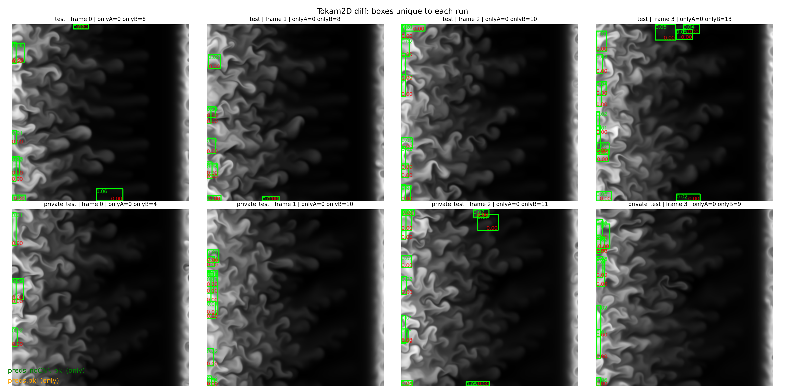

# Structure Detection in Fusion Plasma Simulations

Full pipeline to detect and localize blob-like structures in **fusion plasma simulation** videos (Tokam2D / Codabench).

The main entry point is **`submission.py`** (Codabench-compatible): it trains a YOLO detector, improves it with pseudo-labeling, and applies a lightweight CNN-based post-filter + a few targeted geometric filters at inference time.

## Quick demo

### 1) Run local predictions + create a mosaic

This trains the pipeline on `./train/`, runs inference on a few frames from `./test/test.h5` and `./private_test/private_test.h5`, then saves:
- `mosaic_test_private.png` (visual mosaic)
- `preds.pkl` (raw predictions for later analysis)

```bash
python pred.py
```


### 2) Compare two runs (diff of boxes)

If you have two different `preds.pkl` files (e.g. a run **with** post-processing and the same model **without** post-processing), you can visualize which boxes are unique to each run.

Example:
```bash
# assuming you saved them as preds_FINAL.pkl and preds_NOCNN.pkl
python compare.py preds_FINAL preds_NOCNN
```

This produces `diff_preds_FINAL__preds_NOCNN.png`.



## Repository structure

```text
.
├── submission.py
├── pred.py
├── compare.py
├── README.md
├── mosaic_test_private.png
└── diff_preds__preds_NOCNN.png
```

## Pipeline overview

### Training (inside `train_model()` in `submission.py`)

1. **Dataset conversion (H5 + XML → YOLO format)**
   - Exports frames to PNG.
   - Converts Pascal-VOC-style annotations to YOLO txt labels.

2. **YOLO round 1 (supervised)**
   - Train a YOLOv8n detector on the small labeled set.

3. **MLP scorer for pseudo-labeling**
   - Train an MLP on synthetic positives/negatives created by jittering GT boxes.
   - Used to rank candidate detections on unlabeled data.

4. **Pseudo-label unlabeled data**
   - Run YOLO round 1 on unlabeled frames.
   - Score candidate boxes with the MLP.
   - Keep the **top-k** boxes per image.

5. **YOLO round 2 (semi-supervised)**
   - Retrain YOLO on labeled + pseudo-labeled images.

6. **CNN post-filter mining + training**
   - Mine TP/FP/FN examples on an additional labeled split.
   - Train a small patch-based CNN (`BlobCNN`) to remove false positives.

### Inference (`YOLOWrapper.forward()`)

1. YOLO predicts candidate boxes (low conf threshold → high recall).
2. Apply targeted post-processing filters:
   - remove right-edge artifacts
   - drop nested/container boxes
   - blackness filter (very dark boxes)
   - drop a known bottom-right recurring artifact
3. Apply the CNN post-filter on specific “artifact-prone” image zones.
4. Return final detections as CPU tensors (`boxes`, `scores`, `labels`) + optional `cnn_probs`.

## File guide

- **`submission.py`**: competition submission (training + inference)
  - `train_model(training_dir)`: entry point expected by Codabench
  - `YOLOWrapper`: inference wrapper (YOLO + post-processing + optional CNN filter)
  - dataset conversion utilities, pseudo-labeling utilities
  - `BlobCNN` + mining/training utilities

- **`pred.py`**: local runner
  - trains the model locally
  - runs inference on a few frames
  - saves `mosaic_test_private.png` and `preds.pkl`

- **`compare.py`**: run-to-run comparison
  - loads two `*.pkl` prediction files
  - matches boxes greedily by IoU
  - draws only the **unique** boxes from each run and saves a diff mosaic

## Notes

- This repository is intentionally kept close to the Codabench submission format (single-file core pipeline).
- The pipeline is designed for **very small labeled data** and relies on pseudo-labeling + post-filtering for precision.

## Author

Baptiste PRAS — baptiste.pras@universite-paris-saclay.fr