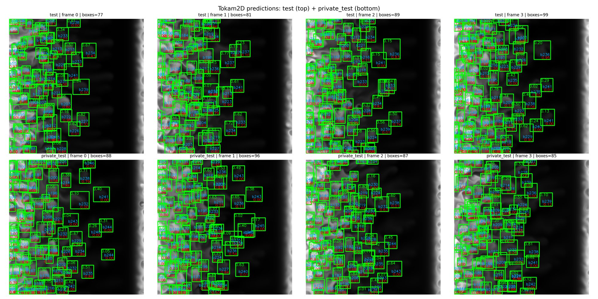
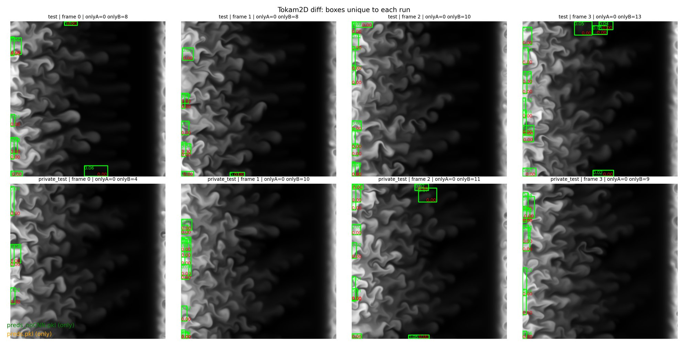

# Structure Detection in Fusion Plasma Simulations

Detection of blob structures in Tokam2D plasma turbulence simulations with YOLOv8, pseudo-labeling, and a learned post-filter. Ranked 4th out of 94 on the [Codabench challenge](https://www.codabench.org/competitions/11224/), with 81% AP50.

<p align="center">
  
</p>
<p align="center"><sub>Final pipeline on four frames of the public test set (top) and the private test set (bottom). Each green box is a detected blob with its confidence.</sub></p>

Blobs are coherent filaments of dense plasma that travel from the edge of a fusion reactor toward its wall. The task is to localize them on density frames of Tokam2D simulations. Labeled frames are very few, and many blobs are faint and low contrast. The pipeline is built around this constraint: a small detector learns from the labeled frames, its training set grows with pseudo-labels chosen by a second model, and a classifier trained on the detector's own mistakes removes false positives at inference.

## Results

The final pipeline reached **81% AP50** and ranked **4th out of 94** participants. The learned post-filter only acts on low-confidence boxes in the zones where artifacts concentrate (left side, top right and bottom right corners):

<p align="center">
  
</p>
<p align="center"><sub>Boxes that differ between the final pipeline and the same detector without the post-filter.</sub></p>

Many other ideas were tested and did not improve the score, such as larger backbones, self-supervised pretraining, and synthetic data. They are listed in [docs/implementation.md](docs/implementation.md#what-did-not-help).

## Environment

The project uses its own environment, `plasma-blobs`, defined in [`environment.yml`](environment.yml):

- Python 3.12;
- PyTorch and Ultralytics (YOLOv8) for detection, OpenCV, h5py, NumPy, Pillow, PyYAML, and Matplotlib.

The code runs on CUDA, Apple GPUs (MPS), and CPU. A GPU is strongly recommended, since the pipeline trains YOLO twice. The first run downloads the pretrained `yolov8n.pt` weights, so it needs internet access.

```bash
mamba env create -f environment.yml   # create the environment once
mamba activate plasma-blobs           # activate it in every new terminal
```

## Data

For data confidentiality reasons, the challenge data is not included in this repository. It is distributed to the participants of the [Codabench challenge](https://www.codabench.org/competitions/11224/). The scripts expect it at the project root as `train/`, `test/test.h5`, and `private_test/private_test.h5`.

## Quick start

```bash
python pred.py                              # train the full pipeline, predict 8 frames, save a mosaic
python compare.py preds_FINAL preds_NOCNN   # draw the boxes unique to each of two saved runs
```

Every command and its outputs are in [docs/usage.md](docs/usage.md).

## Repository layout

```
submission.py   the full pipeline, in one file as Codabench requires
pred.py         local runner
compare.py      comparison of two runs
assets/         figures of this README
docs/           implementation and usage
```

## Documentation

- [Implementation](docs/implementation.md): the training pipeline, inference, the failed attempts, and the role of each file.
- [Usage](docs/usage.md): setup and every command, with what it does and its outputs.

## References

- G. Jocher, A. Chaurasia, and J. Qiu. Ultralytics YOLOv8. 2023. https://github.com/ultralytics/ultralytics
- J. Redmon, S. Divvala, R. Girshick, and A. Farhadi. You only look once: unified, real-time object detection. *CVPR*, 2016.
- D.-H. Lee. Pseudo-label: the simple and efficient semi-supervised learning method for deep neural networks. *ICML Workshop on Challenges in Representation Learning*, 2013.

## License

The code of this project is released under the [MIT License](LICENSE). The detector relies on [Ultralytics YOLOv8](https://github.com/ultralytics/ultralytics), which keeps its own AGPL-3.0 license.
